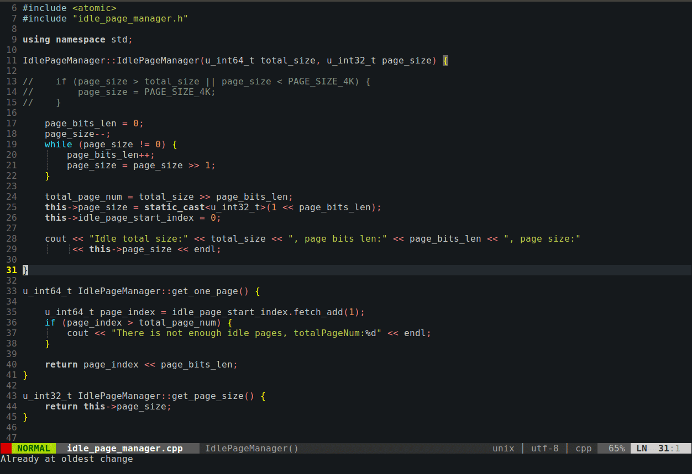
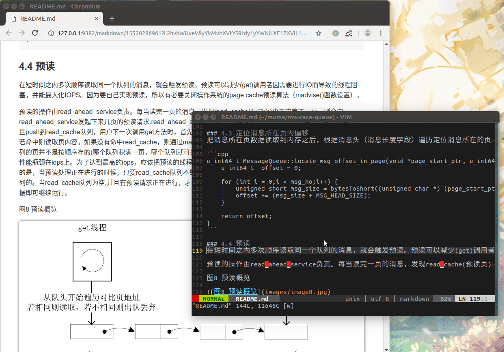

## 演示
##### 编写C++

##### 编写Markdown


Markdown插件的使用方法[参见](https://github.com/iamcco/markdown-preview.nvim)。

## 配置(暂仅支持Ubuntu16.04)
> Vim 版本需要 > 7.4, 并且支持python3 (我使用的是ubuntu16.04,使用apt 安装的vim自然支持)

先对原来的配置文件进行备份

```
$ cp ~/.vim ~/vim_bak
$ cp ~/.vimrc ~/vimrc_bak
```

clone vim配置文件,并把文件拷贝到相应的位置:

```
$ git clone https://github.com/yiranFancier/vim.git ~/vim
$ cp ~/vim/vimrc ~/.vimrc
$ mv ~/vim ~/.vim
```

接着运行vim:

```
$ vim
```

在vim编辑器里运行命令:
```
:BundleInstall
```

上条的指令的作用是通过Vundle安装我所使用的Vim各种插件。其中一个牛逼的自动补全插件YouCompleteMe比较大，需要耐心等待。Vundle的使用方法[参见](https://github.com/vim-scripts/vundle)。

下来需要为插件YcmComplete安装C++补全所需要的环境，YouCompleteMe具体的使用方法[参见](https://github.com/Valloric/YouCompleteMe#c-family-semantic-completion)。
```
$ cd ~/.vim/bundle/YouCompleteMe
$ ./install.py --clangd-completer
```
All done!!! Have a nice time!!!!


